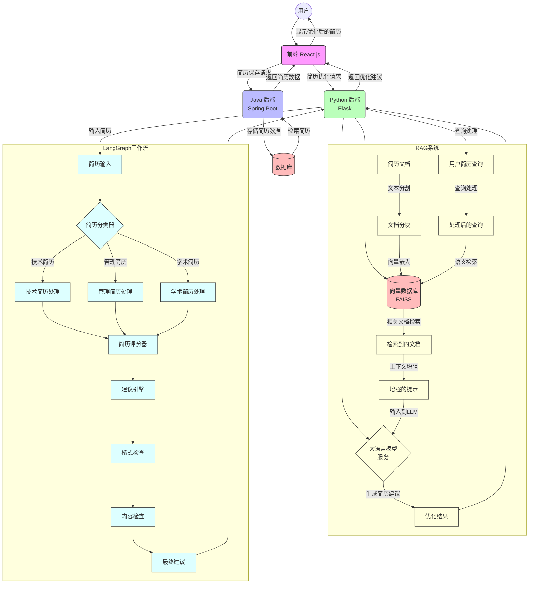

# ResumeTony

## 项目介绍

ResumeTony 是一个强大的简历修改和管理应用，旨在帮助用户创建、编辑和优化专业简历。该应用具有直观的用户界面和丰富的功能，让简历制作和维护变得简单高效。

## 系统架构

该应用采用前后端分离的架构设计：

- **前端**：基于 Node.js 的现代化 Web 界面
- **Java 后端**：负责数据持久化和存储功能
- **Python 后端**：提供简历修改和优化功能

# ResumeTony 项目流程图




## 主要功能(还都没实现目前只是demo)

- 简历创建和编辑
- 专业模板选择
- 实时预览功能
- 格式优化建议
- 内容完善建议
- 多格式导出（PDF, DOCX等）
- 历史版本管理

## 技术栈

- **前端**：React.js
- **后端**：
  - Java Spring Boot（数据存储）
  - Python Flask（简历优化）
- **启动脚本**：Python

## 安装与部署

### 前提条件

- Python 3.6+ 
- Java 8+
- Node.js 14+
- npm 6+

### 安装步骤

1. 克隆仓库：
```bash
git clone https://github.com/ZUOLI11111111/ResumeTony.git
cd ResumeTony
```

2. 安装前端依赖：
```bash
cd frontend
npm install
cd ..
```

3. 安装后端依赖：
```bash
# Java后端
cd backend_of_java_for_save
mvn install
cd ..

# Python后端
cd backend_of_py_for_mododify
pip install -r requirements.txt
cd ..
```

## 使用方法

### 启动应用

使用一键启动脚本启动整个应用：

```bash
python start_resume_app.py
```


## 贡献指南

欢迎提交 Pull Request 或创建 Issue 来帮助改进这个项目。

## 许可证

MIT License 