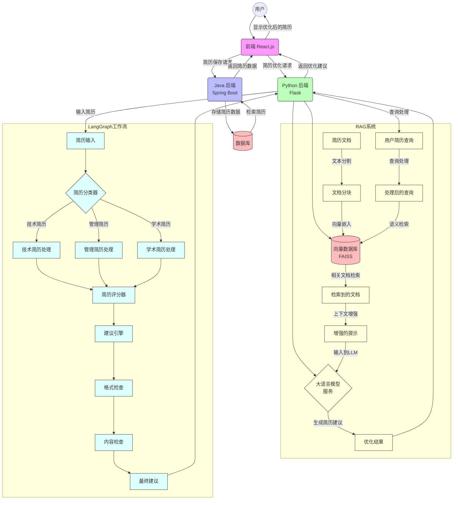

# ResumeTony 项目流程图

上图展示了 ResumeTony 智能简历优化系统的完整流程图，包含以下主要组件：

## 核心组件
- **前端系统**：基于 React.js 的用户界面
- **Java 后端**：使用 Spring Boot 构建，负责数据持久化和存储
- **Python 后端**：使用 Flask 构建，负责简历优化和 AI 处理
- **数据库**：存储用户简历数据和模板

## 智能优化引擎
- **RAG 系统**：检索增强生成系统，通过向量数据库检索相关简历知识
  - 文档分块和处理
  - 向量嵌入和存储
  - 相关文档检索
  - 上下文增强提示
  - 生成优化建议

- **LangGraph 工作流**：复杂简历处理流程
  - 简历分类器（技术、管理、学术）
  - 特定领域处理流程
  - 简历评分和分析
  - 建议引擎
  - 格式和内容检查

## 数据流向
1. 用户通过前端提交简历
2. 前端将请求分发到相应后端
3. Java 后端处理数据存储相关操作
4. Python 后端处理智能优化相关操作
5. RAG 系统和 LangGraph 工作流生成优化建议
6. 优化结果返回前端展示给用户

该流程图展示了系统的微服务架构和各组件间的交互关系，体现了 ResumeTony 作为一个现代化 AI 增强应用的核心设计理念。 